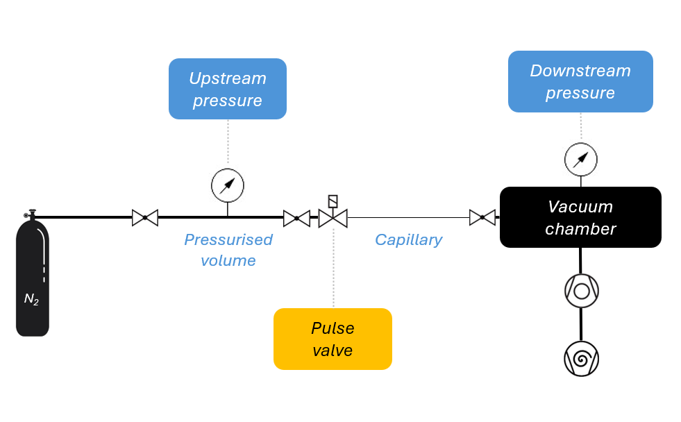

# PULSE-VALVE-DRIVER

Python driver for serial pulse valve systems with real-time pressure and temperature logging, plus high-rate capture of individual pulse transients.

Designed for gas handling characterisation work: fire single calibrated pulses through a pulse valve, log upstream pressure, upstream temperature, and vacuum chamber pressure, and export timestamped CSV data for post-processing. A capture mode streams the chamber gauge at kHz rates through a single shot, which is the only way to measure the peak a pulse actually produces.

---

## Experiment setup



N₂ supply → isolation valve → **pressurised volume** (upstream pressure sensor) → 
isolation valve → **pulse valve** → conductance limiter → vacuum chamber (downstream pressure sensor + turbopump).

---

## Features

- Single-shot pulse valve control via ZC1 controller over RS-232/USB
- Real-time upstream pressure and temperature logging (Keller PAA series)
- Vacuum chamber pressure logging via LabJack U3 (log-linear gauge)
- **Pulse capture**: hardware-streamed chamber pressure through a single shot, with the valve fired automatically inside the capture window
- Automatic analysis of each capture — peak, Δp, rise time, decay constant, effective pumping speed, gas delivered per pulse
- Single timestamped CSV per session with per-pulse events embedded inline (microsecond resolution), plus one CSV per capture
- Auto-detection of serial devices on any COM port, with automatic reconnection if a device disconnects mid-session
- Tkinter GUI: live readouts, three synchronised strip charts (upstream pressure, upstream temperature, vacuum chamber), and a valve driver terminal
- Companion tools for plotting sessions, plotting single captures, and diagnosing the vacuum gauge

---

## Hardware

| Device | Interface | Role |
|---|---|---|
| Keller PAA-23SX-H2 | RS-485 / USB (K-114 adapter) | Upstream pressure + temperature |
| ZC1 controller | RS-232 / USB | Pulse valve driver |
| LabJack U3 | USB | Vacuum chamber gauge on FIO2 |

The LabJack is optional for logging but **required for capture**, which uses the U3's hardware streaming mode.

Only one process may hold the U3 at a time. Close any other program that opens it before running the driver.

---

## Requirements

```
pip install pyserial keller-protocol LabJackPython matplotlib
```

LabJackPython is optional — the driver runs without it if no vacuum gauge is connected, but capture is then unavailable. `matplotlib` is only needed for the plotters, not the driver itself.

---

## Usage

```bash
python PULSE-VALVE-DRIVER.py
```

### Valve driver commands

| Command | Action |
|---|---|
| `v` | Fire one pulse, no capture |
| `c [n]` | Capture n pulses at high rate (default 1, max 50) |
| `t <µs>` | Set open time (50 – 5 000 000 µs) |
| `q` | Quit |

The open time in force is shown in the driver window, recorded in every session CSV row, and written into each capture file header — so pulses fired at different open times are always distinguishable.

### Capture

`c` streams AIN2 in hardware, records a baseline, fires the valve itself, then records the transient and tail:

```
[-- CAPTURE_PRE_S baseline --][FIRE][-- CAPTURE_POST_S transient + tail --]
```

Nothing needs to be timed by hand. Normal monitoring pauses for the window and resumes automatically. `c 20` runs twenty shots with a settling pause between each and prints mean ± spread at the end.

The stream rate is probed at the first capture: a ladder of rates is tried fastest-first and the first one the U3 sustains cleanly is cached for the session. The probe runs before the valve is armed, so a rejected rate never wastes a shot.

**Why capture exists.** The 10 Hz monitoring loop samples every 100 ms. A pulse transient decays with a time constant of order 100 ms, so the "peak" it records is wherever the sampler happened to land — systematically low, by an amount that cannot be recovered afterwards. Capture samples fast enough that the recorded peak is the peak the gauge saw.

---

## Output

Written to a `logs/` folder.

### `pvd-sensor_<timestamp>.csv` — one per session

Sensor readings at the configured cadence, with pulse events embedded in the row covering the interval they occurred in.

| Column | Description |
|---|---|
| `timestamp` | ISO 8601 |
| `keller_pressure_bar` | Mean upstream pressure over interval (blank if no samples) |
| `keller_temperature_degC` | Mean upstream temperature over interval (blank if no samples) |
| `n_keller_samples` | Number of Keller samples averaged for the row |
| `vacuum_chamber_mbar` | Vacuum gauge reading |
| `pulses_interval` | Pulses fired since last row |
| `pulses_total` | Cumulative pulse count |
| `open_time_us` | Valve open-time setting |
| `pulse_timestamps_us` | Semicolon-separated microsecond timestamps of any pulses in this interval (blank if none) |
| `pulse_open_times_us` | Semicolon-separated open times for those pulses |
| `pulse_acks` | Semicolon-separated ACK flags (1 = ZC1 acknowledged, 0 = no response) |

Rows with no pulse in their interval leave the three `pulse_*` columns blank, so filtering to pulse rows is simply a matter of selecting rows where `pulse_timestamps_us` is non-empty.

### `pulse_<timestamp>.csv` — one per capture

A commented header of derived values, then the decimated trace with `t = 0` at the fire command.

| Header key | Description |
|---|---|
| `capture_rate_hz` | Stream rate actually used |
| `analysis_rate_hz` | Rate after decimation |
| `open_time_us`, `zc1_ack` | Valve setting, and whether the ZC1 acknowledged the shot |
| `p_base_mbar`, `baseline_sd_mbar` | Pre-trigger baseline and its scatter |
| `peak_mbar`, `dp_mbar` | Peak pressure, and peak above baseline |
| `t_peak_s`, `t_rise_10_90_s` | Time to peak, and 10–90 % rise time |
| `integral_mbar_s` | Area under the excess, whole post-fire trace |
| `tau_s`, `r2` | Decay constant and fit quality |
| `fit_start_s`, `fit_start_frac` | Where the decay fit began |
| `chamber_volume_l`, `s_eff_l_s` | Volume assumed, and V/τ |
| `q_pulse_mbar_l_integral` | Gas per pulse, S_eff × integral |
| `q_pulse_mbar_l_v_dp` | Gas per pulse, V × Δp |
| `samples_missed` | Stream samples dropped (should be 0) |

Because the volume used is recorded, any capture can be re-analysed with a better volume estimate later without retaking data.

---

## What the capture numbers mean

**τ (tau)** — the chamber's decay time constant, measured from the shape of the tail alone. Every τ seconds, whatever excess pressure remains falls to 36.8 % of its previous value. It follows from V/S_eff, and needs no volume estimate to measure. Practically, the chamber is back to baseline after about 5τ.

**S_eff = V / τ** — the pumping speed the chamber actually experiences, which is the pump's nameplate degraded by everything between chamber and pump. Constant in molecular flow (below ~10⁻³ mbar), but species-dependent: an S_eff measured in N₂ does not transfer to H₂.

**Q_pulse** — gas delivered per shot, in mbar·L. This is the number that characterises the *valve*, as opposed to peak pressure which characterises your particular chamber. Computed two ways:

- `S_eff × ∫p dt` — counts every molecule as the pump removes it, whenever it arrived
- `V × Δp` — assumes all the gas is in the chamber at once

Both scale linearly with the assumed volume, so their **ratio** is volume-independent and tests only the shape of the injection. If a conductance limiter spreads the arrival over a time comparable to τ, the pump removes gas while it is still arriving, `V × Δp` under-reads, and the integral route is the one to use. The driver warns when the rise exceeds 15 % of τ.

**r²** — how well a single exponential describes the fitted region. An exponential is a straight line on a log axis, so r² is measuring straightness. Values below ~0.98 suggest more than one process is acting.

**Sustained rate.** For continuous pulsing at rate f, the steady-state elevation above baseline is `p = Q_pulse × f / S_eff`. Useful for finding the repetition rate at which a chamber pressure limit would be reached.

---

## Companion tools

**`LOG-PLOTTER.py`** — overlay plot of a whole session at the logging cadence. Run with no arguments to open a file picker, or pass a CSV directly. Plots upstream pressure and temperature (top panel, twin axes), vacuum chamber pressure (bottom panel, log scale), and pulse events as vertical markers across both.

```bash
python LOG-PLOTTER.py                    # pick a file, plot whole session
python LOG-PLOTTER.py log.csv --zoom     # crop to around the pulses
python LOG-PLOTTER.py log.csv --open-time 90    # optional: one open-time only
```

**`PULSE-PLOTTER.py`** — detailed plot and re-analysis of a single capture. Same file-picker behaviour. Marks the baseline, the fire instant, the peak, the time to peak, and shades the rise and decay-fit regions.

```bash
python PULSE-PLOTTER.py                              # pick a capture
python PULSE-PLOTTER.py cap.csv --volume 15.586      # re-analyse with a new volume
python PULSE-PLOTTER.py cap.csv --logfit             # add the log-axis fit plot
python PULSE-PLOTTER.py cap.csv --xlim -0.5 2.0      # widen the time axis
```

Baseline estimator is selectable with `--baseline drift|mean|all` (default `drift`, a sloped line fitted through the pre-trigger samples and the far tail). All three are printed on every run so the choice is visible.

**`VACUUM-DIAG.py`** — standalone diagnostic for the vacuum gauge on FIO2. Prints raw voltage and converted pressure, and flags ADC saturation or a floating input.

---

## Configuration

Edit the `CONFIGURATION` block at the top of `PULSE-VALVE-DRIVER.py`:

```python
KELLER_PORT        = None       # None = auto-detect, or e.g. "COM15"
ZC1_PORT           = None       # None = auto-detect, or e.g. "COM18"
DEFAULT_OPEN_US    = 1600       # default valve open time (µs)
LOG_INTERVAL_S     = 0.5        # sensor log cadence (s)
KELLER_POLL_HZ     = 4          # Keller sampling rate (Hz)

CAPTURE_RATE_LADDER = (5000, 2500, 2000, 1000, 500)   # Hz, fastest first
CAPTURE_PRE_S       = 1.0       # baseline recorded before the pulse (s)
CAPTURE_POST_S      = 5.0       # transient + tail recorded after (s)
CAPTURE_DECIMATE    = 10        # samples averaged per analysis point
CAPTURE_SETTLE_S    = 3.0       # pause between shots in a multi-shot run (s)

CHAMBER_VOLUME_L    = 10.0      # chamber volume, for S_eff and Q_pulse
CHAMBER_LIMIT_MBAR  = 1.0e-6    # limit being demonstrated against
```

`CAPTURE_POST_S` should be at least 5τ so the tail is fully captured, and `CHAMBER_VOLUME_L` should be set from CAD before quoting S_eff or Q_pulse.

---

## Vacuum gauge calibration

The LabJack FIO2 input uses a log-linear conversion:

```
log10(P / mbar) = 5.389 × V − 11.329
```

The LabJack U3 single-ended ADC saturates at ~2.44 V, corresponding to ~1 mbar. Readings above this pressure will be pegged. See `VACUUM-DIAG.py` for a standalone diagnostic.

Gauge readings are gas-species dependent. For a Pirani/cold-cathode combination gauge the displayed value is calibrated for air/N₂; multiply by the manufacturer's factor for other species (H₂ ≈ 2.4, He ≈ 5.9, Ar ≈ 0.8). A 10⁻⁶ mbar limit in hydrogen therefore corresponds to a displayed ~4×10⁻⁷.

---

## License

MIT License — see [LICENSE](LICENSE)